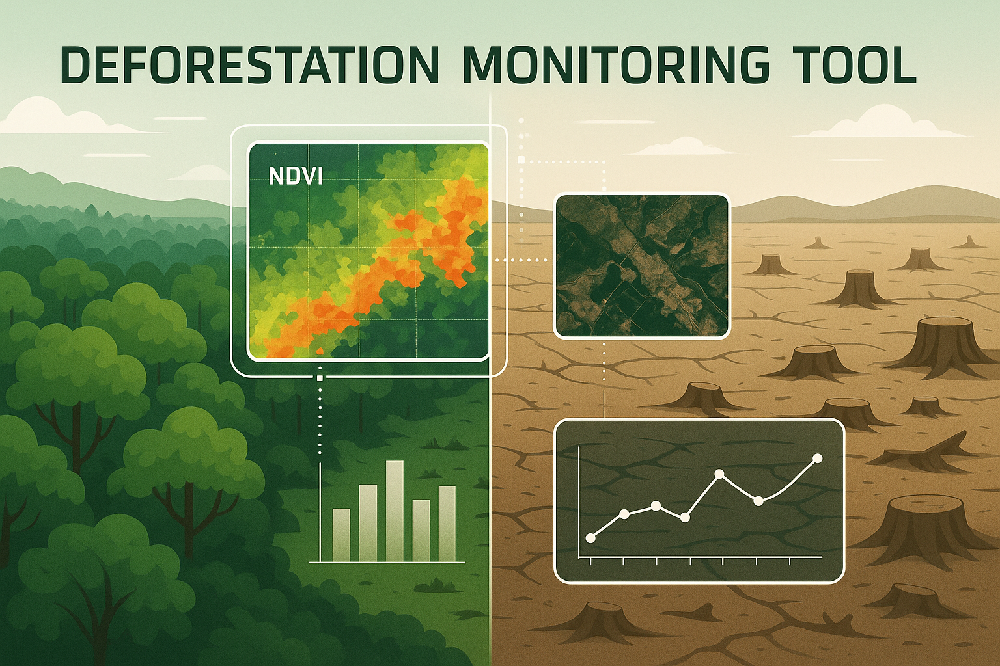
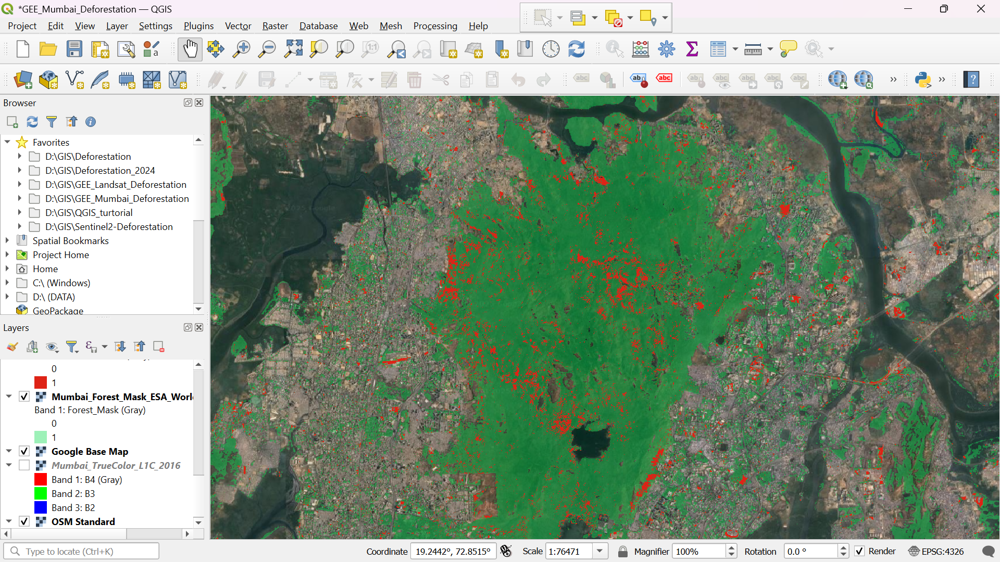

# 🌳 Deforestation Monitoring Tool



<p align="center">
  
  
  
  
  
</p>

> **A full-stack solution for detecting and visualizing deforestation using Google Earth Engine and QGIS with Sentinel-2 and Landsat-8 imagery.**

---

## 📌 Overview
This project consists of two integrated modules:

- 🌐 **Web App**: A Flask + Google Earth Engine-powered platform to generate NDVI maps based on user input (coordinates, radius, year).
- 🚁 **QGIS Analysis**: A QGIS project that provides time-series NDVI comparison for Mumbai, Navi Mumbai, and Thane between 2016 and 2024.

---

## 🗂 Repository Structure
```
deforestation-monitoring-tool/
├── web-app/               # Flask Web Application
│   ├── backend/           # Python + GEE logic
│   ├── frontend/          # HTML templates
│
├── qgis-analysis/         # NDVI Analysis using QGIS
│   ├── sentinel/          # Sentinel-2 imagery & project
│   └── landsat/           # Landsat-8 imagery & project
│
├── report/                # Final Report
│   └── Mini_Project_Report.pdf
│
├── assets/                # Banner & screenshots
│   └── screenshots/       # Screenshots go here
│
├── LICENSE
└── README.md
```

---

## 🚀 Technologies Used
| Module         | Technology/Tool                |
|----------------|---------------------------------|
| Web App        | Python, Flask, Folium, GEE API |
| GIS Analysis   | QGIS, NDVI, Raster Tools        |
| Data Sources   | Sentinel-2, Landsat-8           |
| Output Format  | HTML, TIFF, PNG, CSV            |

---

## ⚙️ Installation
### 🔧 Web App
```bash
git clone https://github.com/AnishBandal/deforestation-monitoring-tool.git
cd deforestation-monitoring-tool/web-app/backend
python3 -m venv venv
source venv/bin/activate   # or venv\Scripts\activate on Windows
pip install -r requirements.txt
earthengine authenticate
flask run
```
Visit `http://127.0.0.1:5000` in your browser.

---

### 🚁 QGIS Analysis
1. Open `.qgz` files from the `qgis-analysis/` folder in QGIS Desktop.
2. Load the corresponding TIFF images (2016–2024).
3. Use the raster calculator for NDVI difference analysis.
4. Export visual results and statistics.

---

## 🎯 Features
- 🗽 Generate NDVI vegetation loss maps dynamically.
- 📊 Stats & charts to track vegetation health loss over time.
- 🌍 Region-based QGIS NDVI comparisons (Mumbai, Navi Mumbai, Thane).
- 🧾 Final PDF report included.

---

## 📸 Screenshots

<p float="left">
  
  
</p>

> Add screenshots to `assets/screenshots/` folder and reference above.

---

## 🗃️ TIFF Data Download (Google Drive)

Due to GitHub file size limits, NDVI `.tif` files are hosted externally:

📅 **[Download TIFF files from Google Drive](https://drive.google.com/drive/folders/1HEhRcsDEIwpjgBGQPrHKBqRZ1mA7E8KV?usp=sharing)**

Includes:
- Sentinel & Landsat True Color Map of 2016 

---

## 📄 Project Report
- [📘 Mini Project Report (PDF)](report/Mini_Project_Report.pdf)

---

## 👤 Authors

**Anish Ganesh Bandal**  
🎓 BTech IT, Vidyalankar Institute of Technology  
🔗 [GitHub](https://github.com/AnishBandal)

**Mukta Redij**  
🎓 BTech IT, Vidyalankar Institute of Technology  
🔗 [GitHub](https://github.com/MuktaRedij)

**Atharva Gitaye**  
🎓 BTech IT, Vidyalankar Institute of Technology  
🔗 [GitHub](https://github.com/atharvagitaye)


---

## 📄 License

This project is licensed under the **MIT License**.  
See the full [LICENSE](LICENSE) file for details.

